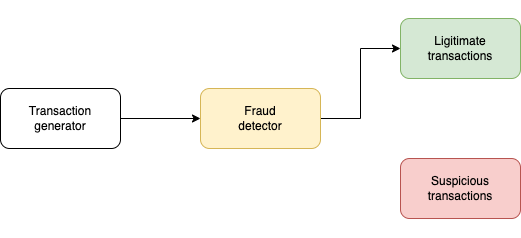
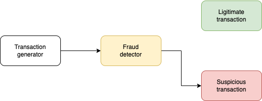
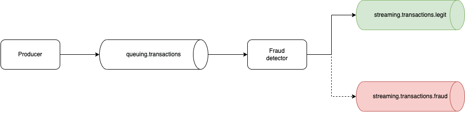

# Kafka Fraud Detector

[](https://kafka.apache.org)
[](https://github.com/confluentinc/cp-docker-images)
[](https://www.python.org)


# Description

The fraud detector is a typical example of a stream processing application.

It takes a stream of transactions as an input, performs some kind of filtering, then outputs the result into two separate streams — those that are legitimate, and those that are suspicious
The fraud detector will not be a plain consumer, though. It is a streaming application. As such, it uses a consumer to read messages, then does its own processing on those messages and produces messages back into one of the two output topics. So we'll need a consumer and a producer.

Here's the architecture diagram:




And for suspicious transactions:




Beyond producers that publish messages into a topic, there exists another type of Kafka applications to read messages from a topic. They are called consumers. 





## Quickstart

### Run broker 


```bash
docker-compose up -d --build zookeeper broker
```


### Run generator and detector

```bash
docker-compose up -d --build generator detector
```

## Usage

```bash
docker-compose exec broker kafka-console-consumer --bootstrap-server localhost:9092 --topic T
```

Topics:

- `queuing.transactions`: raw generated transactions
- `streaming.transactions.legit`: legit transactions
- `streaming.transactions.fraud`: suspicious transactions


Enjoy!